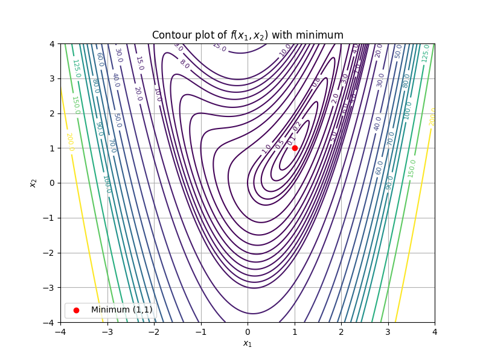

# DFP vs Gradient Descent on the Rosenbrock Function

**Quarter:** Spring 2025  

In this project we implemented gradient descent (steepest descent) and the DFP quasi-Newton method to minimize the Rosenbrock function, a classic nonlinear optimization test case whose global minimum sits inside a long, narrow, curved valley. Both methods use an Armijo backtracking line search to choose step sizes, and we animated the convergence paths over the function's contour plot to visualize how differently the two algorithms behave.

## Contents

| File                         | Description                                                                                                                                                                                                                      |
| ---------------------------- | -------------------------------------------------------------------------------------------------------------------------------------------------------------------------------------------------------------------------------- |
| `rosenbrock_optimization.py` | Defines the Rosenbrock function and its gradient, implements Armijo backtracking, gradient descent, and DFP, then runs both methods from two starting points and saves animated convergence paths as MP4 files.                  |

## Background

The Rosenbrock function is:

$$f(x_1, x_2) = (x_2 - x_1^2)^2 + (1 - x_1)^2$$

Its global minimum is at $(1, 1)$ with $f = 0$. The function is smooth but its minimum lies inside a shallow, banana-shaped valley that makes convergence slow for first-order methods.

Each iteration of both methods has two parts: choosing a **search direction** $p_k$ to move in, and choosing a **step size** $\alpha$ (also called step length) for how far to move along that direction. The next iterate is $x_{k+1} = x_k + \alpha p_k$. Too small a step makes slow progress; too large a step can overshoot the minimum or even increase $f$.

**Gradient descent** (steepest descent) moves in the direction opposite the gradient at each step: $p_k = -\nabla f(x_k)$. This is the direction of steepest local decrease, but on curved valleys it produces a characteristic zigzag pattern where successive search directions are perpendicular to each other.

**DFP** (Davidon-Fletcher-Powell) is a quasi-Newton method. Instead of using just the gradient, it builds an approximation $H_k$ to the inverse Hessian (a matrix encoding the local curvature of $f$) and updates it at every step using gradient differences. The search direction is $p_k = -H_k \nabla f(x_k)$, which takes curvature into account and typically converges much faster than gradient descent.

Both methods use an **Armijo backtracking line search** to select the step size $\alpha$ at each iteration. Starting from $\alpha_0 = 2$, the step is shrunk by a factor $\rho = 0.95$ until the sufficient decrease condition

$$f(x + \alpha p) \leq f(x) + c \cdot \alpha \cdot \nabla f(x)^\top p$$

is satisfied with $c = 0.5$. The stopping criterion is $\|\nabla f(x)\| < 10^{-3}$.

## Results

### Contour Plot

The contour plot below shows the Rosenbrock function. The global minimum at $(1, 1)$ is marked in red.



### Numerical Results

**Starting from $x_0 = (-4,\ 4)$:**

| Method           | Iterations | Final $x$                 | Final $f(x)$            |
| ---------------- | ---------- | ------------------------- | ----------------------- |
| Gradient Descent | 33         | $(1.00038,\ 1.00090)$     | $1.641 \times 10^{-7}$  |
| DFP              | 14         | $(0.99997,\ 0.99994)$     | $9.005 \times 10^{-10}$ |

**Starting from $x_0 = (-4,\ -4)$:**

| Method           | Iterations | Final $x$                 | Final $f(x)$            |
| ---------------- | ---------- | ------------------------- | ----------------------- |
| Gradient Descent | 38         | $(0.99907,\ 0.99786)$     | $9.418 \times 10^{-7}$  |
| DFP              | 21         | $(1.00001,\ 0.99993)$     | $8.151 \times 10^{-9}$  |

Both methods converge to the true minimum $(1, 1)$ from both starting points. DFP reaches a tighter solution in roughly half the iterations of gradient descent in each case.

### Discussion

The animated paths make the behavioral difference between the two methods visually clear. Gradient descent follows its zigzag pattern most noticeably during the later iterations inside the valley, where the curvature of the banana shape causes alternating overshoots: successive search directions are orthogonal by construction, so only about every other step makes meaningful progress toward the minimum. DFP's convergence path is less predictable but substantially more direct, as the accumulated inverse Hessian approximation allows it to cut through the curved valley rather than bouncing between its walls.

If I were to say one positive thing about gradient descent, it is that its iterations follow a much more predictable and smooth pattern compared to the chaotic convergence path of DFP.

### Animation

[](https://www.youtube.com/watch?v=P0O9hdpaZN4)

*Click to watch the animated convergence paths for gradient descent and DFP from both starting points.*

## Running

```bash
python rosenbrock_optimization.py
```

Dependencies: `numpy`, `matplotlib`

Note: Saving the MP4 animation requires `ffmpeg` to be installed and accessible on your PATH.
